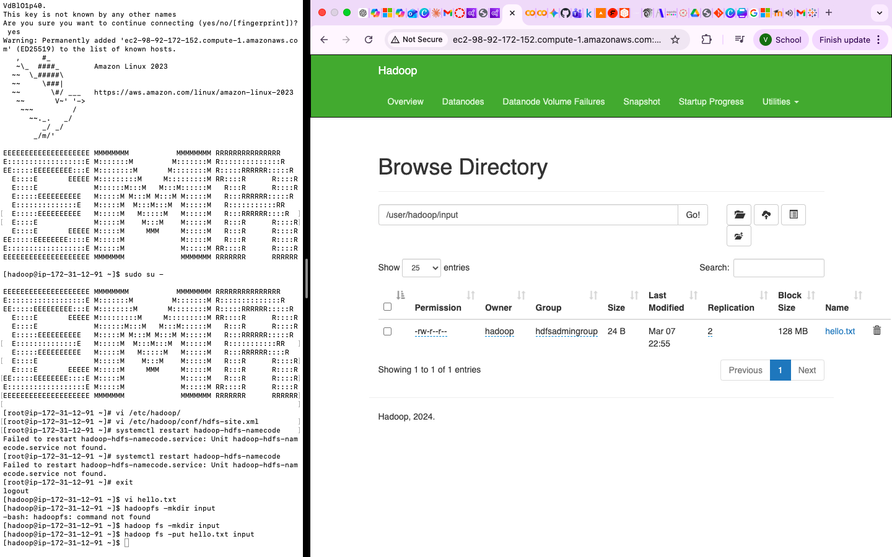
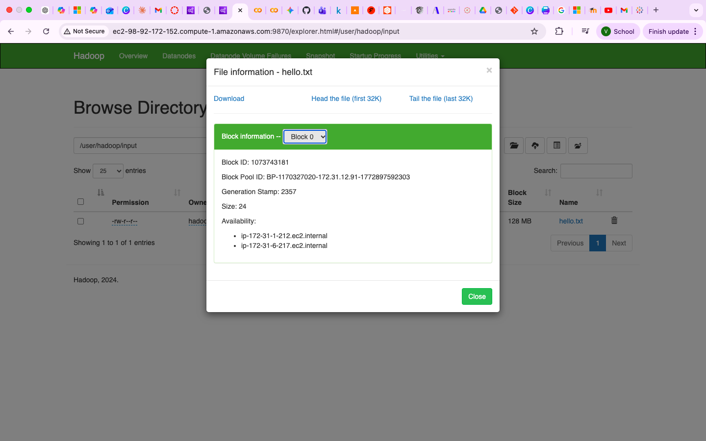

# LAB02 — Hadoop & HDFS

## Objective

This lab introduces Hadoop ecosystem components on AWS EMR, including:

* EMR Cluster Creation
* HDFS Operations
* YARN Resource Management
* MapReduce WordCount
* Apache Pig
* Apache Hive

---

# Part 1 — Create EMR Cluster

## Step 1.1 Start AWS Academy Lab

1. Login to AWS Academy.
2. Open **AWS Academy Learner Lab**.
3. Click **Start Lab**.
4. Wait until AWS status becomes green.
5. Click **AWS** to open AWS Console.

---

## Step 1.2 Create EMR Cluster

Navigate to:

```text
AWS Console
→ Amazon EMR
→ Create Cluster
```

Configuration:

| Setting      | Value     |
| ------------ | --------- |
| Release      | EMR 7.4.0 |
| Applications | Hadoop    |
| Primary Node | 1         |
| Core Node    | 2         |
| Task Node    | Remove    |

---

## Step 1.3 Configure Security

Create or select Security Group.

Inbound Rule:

| Type | Source |
| ---- | ------ |
| SSH  | My IP  |

---

## Step 1.4 Select Key Pair

Choose an existing key pair or create a new key pair.

Example:

```text
bigdata.pem
```

Download and save the private key file.

---

## Step 1.5 Launch Cluster

Click **Create Cluster**.

Wait until cluster status becomes:

```text
Waiting
```

---

## Step 1.6 Connect via SSH

Example:

```bash
ssh -i ~/Downloads/bigdata.pem hadoop@[EMR-PUBLIC-IP]
```

Verify connection:

```bash
whoami
```

Expected result:

```text
hadoop
```

# Part 2 — HDFS Basic Operations

HDFS (Hadoop Distributed File System) is the primary storage layer of 
Hadoop.

The architecture consists of:

* NameNode (metadata management)
* DataNode (data storage)
* Replication mechanism

---

## Step 2.1 Verify Hadoop Installation

Check Hadoop version:

```bash
hadoop version
```

Expected output:

```text
Hadoop 3.x.x
```

---

## Step 2.2 Create Local Input File

Create a CSV file:

```bash
nano RE_66102010185.csv
```

Example content:

```text
66102010185,Vikhom Manpiriya
```

Save and exit.

Verify file:

```bash
cat RE_66102010185.csv
```

---

## Step 2.3 Create HDFS Directory

Create input directory:

```bash
hadoop fs -mkdir input
```

Verify:

```bash
hadoop fs -ls /
```

---

## Step 2.4 Upload File to HDFS

Upload local file:

```bash
hadoop fs -put RE_66102010185.csv input
```

Verify upload:

```bash
hadoop fs -ls input
```

Expected result:

```text
Found 1 items
...
RE_66102010185.csv
```

---

## Step 2.5 Read File from HDFS

Display file content:

```bash
hadoop fs -cat input/RE_66102010185.csv
```

Expected output:

```text
66102010185,Vikhom Manpiriya
```

---

## Step 2.6 HDFS Administration

Display cluster report:

```bash
hdfs dfsadmin -report
```

This command shows:

* Number of DataNodes
* Storage capacity
* Used space
* Remaining space

---

## Step 2.7 Set Replication Factor

```bash
hdfs dfs -setrep -w 2 input/RE_66102010185.csv
```

Verify:

```bash
hdfs fsck input/RE_66102010185.csv -files -blocks
```

Expected result:

```text
Replication factor: 2
```

---

## Step 2.8 Open HDFS Web UI

Open browser:

```text
http://[PRIMARY-NODE]:9870
```

Navigate:

```text
Utilities
→ Browse the file system
```

Locate:

```text
/user/hadoop/input
```

Verify:

* Uploaded file exists
* Block information is available
* Replication factor is displayed

---

# Part 3 — YARN Resource Management

YARN (Yet Another Resource Negotiator) is the resource management 
framework used by Hadoop.

YARN is responsible for:

* Resource allocation
* Job scheduling
* Cluster monitoring
* Application execution

---

## Step 3.1 Check YARN Version

```bash
yarn version
```

Expected output:

```text
Hadoop 3.x.x
```

---

## Step 3.2 List Available Nodes

```bash
yarn node -list
```

Expected result:

```text
Total Nodes: 3
```

The output should display:

* Primary Node
* Core Node 1
* Core Node 2

---

## Step 3.3 Open Resource Manager UI

Open browser:

```text
http://[PRIMARY-NODE]:8088
```

Verify:

* Active Nodes
* Running Applications
* Cluster Metrics

---

## Step 3.4 Verify Cluster Status

Check:

* Memory Usage
* CPU Allocation
* Available Resources

This page will be used later to monitor MapReduce jobs.

---

# Part 4 — MapReduce WordCount

MapReduce is Hadoop's distributed processing model.

The WordCount example counts the number of occurrences of each word in an 
input file.

---

## Step 4.1 Download WordCount Source Code

Reference:

```text
https://hadoop.apache.org/docs/current/hadoop-mapreduce-client/hadoop-mapreduce-client-core/MapReduceTutorial.html
```

Create file:

```bash
nano WordCount.java
```

Copy the WordCount v1.0 source code from the Hadoop MapReduce Tutorial.

---

## Step 4.2 Create Build Directory

```bash
mkdir wordcount_classes
```

Verify:

```bash
ls
```

Expected:

```text
wordcount_classes
```

---

## Step 4.3 Compile WordCount.java

```bash
javac -classpath 
/usr/lib/hadoop/client/hadoop-common.jar:/usr/lib/hadoop/client/hadoop-mapreduce-client-core.jar 
-d wordcount_classes/ WordCount.java
```

Verify generated class files:

```bash
find wordcount_classes
```

---

## Step 4.4 Package as JAR File

```bash
jar -cvf ./wordcount.jar -C wordcount_classes/ .
```

Verify:

```bash
ls -lh wordcount.jar
```

---

## Step 4.5 Execute MapReduce Job

```bash
yarn jar ./wordcount.jar WordCount input/* output/wordcount
```

Expected:

```text
Submitted application ...
```

---

## Step 4.6 Verify Output Directory

```bash
hadoop fs -ls output/wordcount
```

Expected:

```text
part-r-00000
_SUCCESS
```

---

## Step 4.7 Display Result

```bash
hadoop fs -cat output/wordcount/part-r-00000
```

Example output:

```text
Hadoop 3
MapReduce 2
WordCount 1
```

---

## Step 4.8 Monitor Job in YARN

Open:

```text
http://[PRIMARY-NODE]:8088
```

Verify:

* Submitted Application
* Completed Status
* Job Duration
* Resource Usage

---

# Part 5 — Apache Pig WordCount

Apache Pig is a high-level platform used to process large datasets on 
Hadoop.

Pig scripts are written using Pig Latin.

---

## Step 5.1 Create Pig Script

Create file:

```bash
nano wordcount.pig
```

Insert the following script:

```pig
A = load 'input/*';
B = foreach A generate flatten(TOKENIZE((chararray)$0)) as word;
C = filter B by word matches '\\w+';
D = group C by word;
E = foreach D generate COUNT(C), group;
store E into 'output/wordcount-pig';
```

Save and exit.

---

## Step 5.2 Execute Pig Script

Run:

```bash
pig wordcount.pig
```

Expected result:

```text
Job completed successfully
```

---

## Step 5.3 Verify Output Directory

```bash
hadoop fs -ls output/wordcount-pig
```

Expected output:

```text
part-v001-o000-r-00000
_SUCCESS
```

---

## Step 5.4 Display Result

```bash
hadoop fs -cat output/wordcount-pig/part-v001-o000-r-00000
```

Example output:

```text
1 Hadoop
2 MapReduce
3 Pig
```

---

## Step 5.5 Compare with MapReduce

Both Pig and MapReduce produce similar results.

Difference:

| MapReduce    | Pig               |
| ------------ | ----------------- |
| Java Code    | Pig Script        |
| Low Level    | High Level        |
| More Complex | Easier to Develop |

Pig simplifies data processing by reducing the amount of code required.

---

# Part 6 — Apache Hive

Apache Hive provides a SQL-like interface for querying data stored in 
Hadoop.

---

## Step 6.1 Create Sample Data File

Create file:

```bash
nano member1.txt
```

Insert:

```text
1,John,Smith,2006-02-15 04:34:33
2,Sawasdee,Thailand,2006-01-01 01:01:01
```

Save and exit.

Verify:

```bash
cat member1.txt
```

---

## Step 6.2 Start Hive

Launch Hive shell:

```bash
hive
```

Expected:

```text
hive>
```

---

## Step 6.3 Create Hive Table

Execute:

```sql
CREATE TABLE member (
    mem_id INT,
    first_name STRING,
    last_name STRING,
    last_update TIMESTAMP
)
ROW FORMAT DELIMITED
FIELDS TERMINATED BY ','
STORED AS TEXTFILE
LOCATION '/user/hadoop/member';
```

Verify:

```sql
SHOW TABLES;
```

Expected:

```text
member
```

---

## Step 6.4 Describe Table

```sql
DESC member;
```

Verify schema:

```text
mem_id
first_name
last_name
last_update
```

---

## Step 6.5 Load Data into Hive

```sql
LOAD DATA LOCAL INPATH '/home/hadoop/member1.txt'
INTO TABLE member;
```

Expected:

```text
Loading data to table default.member
```

---

## Step 6.6 Query Data

```sql
SELECT * FROM member;
```

Expected:

```text
1   John      Smith      2006-02-15 04:34:33
2   Sawasdee  Thailand   2006-01-01 01:01:01
```

---

## Step 6.7 Count Records

```sql
SELECT COUNT(*) FROM member;
```

Expected:

```text
2
```

---

## Step 6.8 Exit Hive

```sql
EXIT;
```

---

## Step 6.9 Create Additional Data

Create file:

```bash
nano member2.csv
```

Insert:

```text
3,xxx,yyy,2006-02-15 04:34:33
```

Save and exit.

---

## Step 6.10 Upload Additional File

```bash
hadoop fs -put member2.csv member
```

Verify:

```bash
hadoop fs -ls member
```

---

## Step 6.11 Query Updated Data

Start Hive again:

```bash
hive
```

Execute:

```sql
SELECT * FROM member;
```

Expected result:

```text
1   John      Smith
2   Sawasdee  Thailand
3   xxx       yyy
```

This demonstrates how Hive can automatically read new files added to the 
table location.

---

# Part 7 — Screenshots

The following screenshots were captured during the execution of this lab.

## HDFS Browser

The HDFS Browser can be accessed through the NameNode Web UI.

```text
http://[PRIMARY-NODE]:9870
```



---

## Replication Verification

The replication factor can be verified through the HDFS Browser.



---

# Part 8 — Troubleshooting

## File Already Exists

```text
put: File exists
```

Solution:

```bash
hadoop fs -rm input/RE_66102010185.csv
```

Upload again:

```bash
hadoop fs -put RE_66102010185.csv input
```

---

## Permission Denied

Verify current user:

```bash
whoami
```

Expected:

```text
hadoop
```

---

## Hive Table Not Found

```sql
SHOW TABLES;
```

Verify that the table exists before running queries.

---

## YARN Job Failed

Open:

```text
http://[PRIMARY-NODE]:8088
```

Check application logs and cluster resources.

---

# Conclusion

In this lab, we learned how to:

* Create and configure an AWS EMR cluster
* Connect to the EMR primary node using SSH
* Create directories and upload files to HDFS
* Manage files using Hadoop File System commands
* Configure and verify HDFS replication
* Browse HDFS using the NameNode Web UI
* Monitor cluster resources using the YARN Resource Manager

These fundamental Hadoop and HDFS operations provide the foundation for 
subsequent labs involving MapReduce, Hive, Spark, and other big data 
technologies.

---

# Author

Vikhom Manpiriya

Student ID: 66102010185

