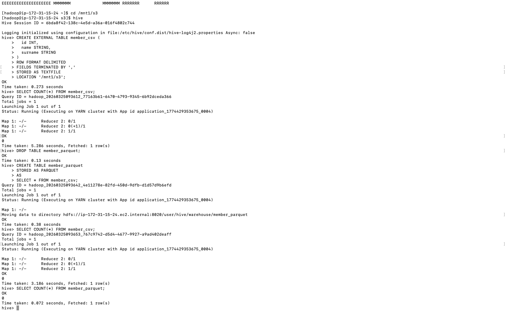

# LAB03 — Hive & Parquet

## Objective

This lab demonstrates how to:

- Create external Hive tables
- Load CSV data into Hive
- Query Hive tables
- Convert Hive tables into Parquet format
- Verify Parquet conversion

---

# Technologies Used

- AWS EMR
- Hive
- Hadoop HDFS

---

# Step 1 — Open Hive

```bash
hive
```

---

# Step 2 — Create External Table

```sql
CREATE EXTERNAL TABLE member_csv (
  id INT,
  name STRING,
  surname STRING
)
ROW FORMAT DELIMITED
FIELDS TERMINATED BY ','
STORED AS TEXTFILE
LOCATION '/mnt1/s3';
```

---

# Step 3 — Verify CSV Data

```sql
SELECT COUNT(*) FROM member_csv;
```

---

# Step 4 — Remove Existing Table

```sql
DROP TABLE member_parquet;
```

---

# Step 5 — Convert CSV Table to Parquet

```sql
CREATE TABLE member_parquet
STORED AS PARQUET
AS
SELECT * FROM member_csv;
```

---

# Step 6 — Verify Parquet Table

```sql
SELECT COUNT(*) FROM member_parquet;
```

---

# Hive Execution Result



---

# Conclusion

This lab demonstrates:
- Hive external table creation
- CSV data querying
- Parquet conversion
- Hive data verification


---

# Author

Vikhom Manpiriya
