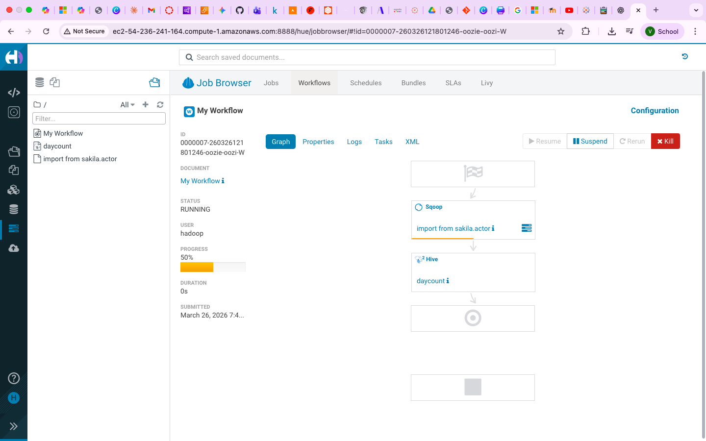
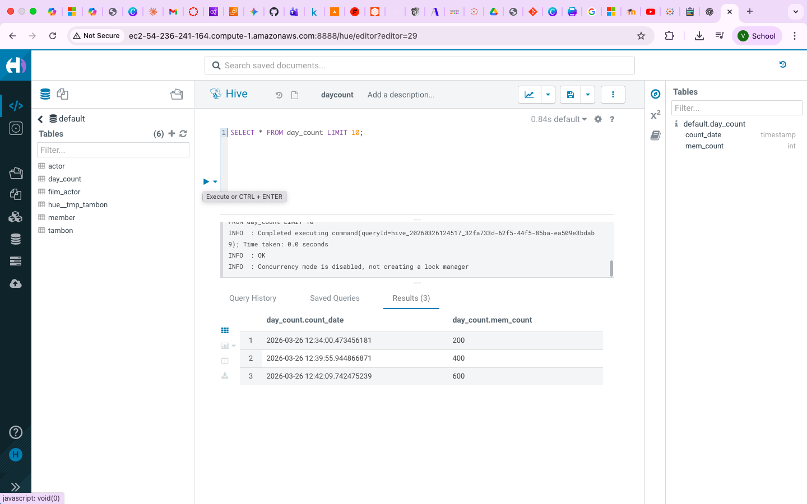

# LAB04 — Sqoop, Hue and Oozie

## Objective

This lab demonstrates how to:

* Import data from MySQL into Hadoop using Sqoop
* Configure MySQL JDBC drivers
* Store database passwords securely using password files
* Query Hive tables using Hue
* Build and schedule Oozie workflows
* Connect to Hive using ODBC and JDBC tools

---

# Technologies Used

* AWS EMR
* MySQL
* Sqoop
* Hive
* Hue
* Oozie
* JDBC
* ODBC

---

# Part 1 — Environment Preparation

## Step 1.1 Create EMR Cluster

Create an EMR cluster using:

```text
Amazon EMR Release: emr-7.4.0
```

Application Bundle:

```text
Core Hadoop
Sqoop
Oozie
```

---

## Step 1.2 Verify Applications

Connect to the EMR Primary Node.

Verify:

```bash
sqoop version
```

```bash
oozie version
```

```bash
hive --version
```

---

## Step 1.3 Create Hive Member Table

Follow the Hive section from LAB03 and create:

```sql
CREATE TABLE member (
    mem_id INT,
    first_name STRING,
    last_name STRING,
    last_update TIMESTAMP
);
```

This table will be used as the import target.

---

# Part 2 — MySQL Sakila Database Setup

Sqoop requires a relational database source.

In this lab we use the Sakila sample database.

---

## Step 2.1 Download Sakila Database

Run as root:

```bash
sudo su -
```

Download:

```bash
wget https://downloads.mysql.com/docs/sakila-db.tar.gz
```

---

## Step 2.2 Extract Files

```bash
tar xvf sakila-db.tar.gz
```

---

## Step 2.3 Import Database

```bash
mysql < sakila-db/sakila-schema.sql
```

```bash
mysql < sakila-db/sakila-data.sql
```

---

## Step 2.4 Verify Database

Login:

```bash
mysql -u root
```

Execute:

```sql
USE sakila;

SHOW TABLES;

SELECT * FROM actor LIMIT 10;
```

---

## Step 2.5 Create Database User

```sql
GRANT ALL PRIVILEGES ON sakila.* TO 'dbuser'@'%'
IDENTIFIED BY 'password'
WITH GRANT OPTION;
```

Exit:

```sql
EXIT;
```

---

# Part 3 — Install MySQL JDBC Driver

Sqoop requires a JDBC driver to communicate with MySQL.

---

## Step 3.1 Download JDBC Driver

Run as root:

```bash
sudo su -
```

Download:

```bash
wget 
https://dev.mysql.com/get/Downloads/Connector-J/mysql-connector-java-5.1.49.tar.gz
```

Extract:

```bash
tar xvf mysql-connector-java-5.1.49.tar.gz
```

---

## Step 3.2 Install JDBC Driver

```bash
mkdir -p /usr/share/java
```

```bash
cp mysql-connector-java-5.1.49/mysql-connector-java-5.1.49.jar \
/usr/share/java
```

---

## Step 3.3 Create Symbolic Links

```bash
ln -sf \
/usr/share/java/mysql-connector-java-5.1.49.jar \
/usr/share/java/mysql-connector-java.jar
```

```bash
ln -sf \
/usr/share/java/mysql-connector-java.jar \
/usr/lib/sqoop/lib/mysql-connector-java.jar
```

Exit root:

```bash
exit
```

---

# Part 4 — Sqoop Import

Sqoop transfers data between relational databases and Hadoop.

---

## Step 4.1 Import Actor Table into HDFS

Run as hadoop user:

```bash
sqoop import \
--connect jdbc:mysql://[MYSQL-HOST]/sakila \
--username dbuser \
-P \
--table actor \
--append \
--target-dir /user/hadoop/member
```

Enter password when prompted.

---

## Step 4.2 Verify Imported Data

```bash
hadoop fs -ls /user/hadoop/member
```

Display content:

```bash
hadoop fs -cat /user/hadoop/member/*
```

---

## Step 4.3 Import Directly into Hive

```bash
sqoop import \
--connect jdbc:mysql://[MYSQL-HOST]/sakila \
--username dbuser \
-P \
--table film_actor \
--hive-import \
--create-hive-table \
--hive-table film_actor
```

---

## Step 4.4 Verify Hive Table

Start Hive:

```bash
hive
```

Execute:

```sql
SHOW TABLES;
```

```sql
SELECT COUNT(*) FROM film_actor;
```

---

# Part 5 — Secure Password File

Entering database passwords manually is inconvenient when automating jobs.

Sqoop supports reading passwords from a file.

---

## Step 5.1 Create Password File

```bash
echo -n "password" > .password
```

Verify:

```bash
cat .password
```

---

## Step 5.2 Upload Password File

```bash
hadoop fs -put .password
```

Verify:

```bash
hadoop fs -ls /
```

---

## Step 5.3 Restrict Permissions

```bash
hadoop fs -chmod 600 .password
```

Verify:

```bash
hadoop fs -ls /
```

---

## Step 5.4 Use Password File with Sqoop

```bash
sqoop import \
--connect jdbc:mysql://[MYSQL-HOST]/sakila \
--username dbuser \
--password-file .password \
--table actor \
--append \
--target-dir /user/hadoop/member
```

This method is commonly used in production workflows and scheduled jobs.

---

# Part 6 — Hue Web Interface

Hue provides a web-based interface for Hadoop services.

---

## Step 6.1 Open Hue

Open browser:

```text
http://[PRIMARY-NODE]:8888
```

When accessing Hue for the first time:

* Create an administrator account
* Use username: hadoop
* Configure a secure password

---

## Step 6.2 Hive Query Editor

Navigate:

```text
Editor
→ Hive
```

Execute:

```sql
SELECT * FROM member LIMIT 10;
```

Verify returned records.

---

## Step 6.3 File Browser

Navigate:

```text
Files
```

Verify:

* HDFS directories
* Uploaded datasets
* Hive warehouse files

---

## Step 6.4 Configure Time Zone

Run as root:

```bash
sudo su -
```

Edit:

```bash
vi /etc/hue/conf/hue.ini
```

Locate:

```text
time_zone=
```

Set:

```text
time_zone=Asia/Bangkok
```

Restart Hue:

```bash
systemctl restart hue
```

---

# Part 7 — Marker Map Exercise

Hue supports visualization features for geographic datasets.

---

## Step 7.1 Download Dataset

Download TAMBON dataset:

```text
TAMBON.csv
```

Convert Excel data into CSV format if necessary.

---

## Step 7.2 Create Hive Table

Navigate:

```text
Tables
→ Hive
→ Default Database
→ + New
```

Upload:

```text
TAMBON.csv
```

Follow the import wizard until table creation completes.

---

## Step 7.3 Verify Imported Data

Run:

```sql
SELECT * FROM tambon LIMIT 10;
```

Verify geographic records.

---

# Part 8 — Oozie Workflow

Oozie automates Hadoop workflows and job scheduling.

---

## Workflow Objective

The workflow performs:

1. Sqoop import from MySQL
2. Hive aggregation
3. Store results in day_count

---

## Step 8.1 Create day_count Table

Start Hive:

```bash
hive
```

Execute:

```sql
CREATE EXTERNAL TABLE day_count (
    count_date TIMESTAMP,
    mem_count INT
);
```

---

## Step 8.2 Add JDBC Driver to Oozie

Run as root:

```bash
sudo su -
```

Execute:

```bash
sudo -u oozie hadoop fs -put \
/usr/share/java/mysql-connector-java.jar \
/user/oozie/share/lib/*/sqoop/
```

Restart Oozie:

```bash
systemctl restart oozie
```

---

## Step 8.3 Create Sqoop Script

Navigate:

```text
Editors
→ Sqoop
```

Script:

```bash
import \
--connect jdbc:mysql://[MYSQL-HOST]/sakila \
--username dbuser \
--password-file .password \
--table actor \
--append \
--target-dir /user/hadoop/member
```

Save as:

```text
import-from-sakila-actor
```

---

## Step 8.4 Create Hive Script

Navigate:

```text
Editors
→ Hive
```

Execute:

```sql
INSERT INTO day_count
SELECT current_timestamp(), count(*)
FROM member;
```

Save as:

```text
day_count
```

---

## Step 8.5 Create Workflow

Create a workflow and arrange tasks in order:

```text
Sqoop Import
↓
Hive Query
```

Run workflow.

---

## Step 8.6 Verify Workflow Result

Execute:

```sql
SELECT * FROM day_count;
```

Verify new records have been inserted.

---

## Oozie Workflow Screenshot



---

# Part 9 — ODBC and JDBC Connectivity

External BI tools can connect directly to Hive.

---

## JDBC

Install:

```text
DBeaver Community Edition
```

Create a Hive JDBC connection.

---

## ODBC

Install:

```text
Power BI Desktop
```

Install:

```text
Cloudera Hive ODBC Driver
```

---

## Hive Connection Settings

```text
Host = [PRIMARY-NODE]
Port = 10000
UID = hadoop
```

---

## Example Clients

Supported tools:

* DBeaver
* Excel
* Power BI
* Tableau

---

# Part 10 — Screenshots

## Oozie Workflow


---

## Hive Query Result



---

# Part 11 — Troubleshooting

## Error: JDBC Driver Not Found

Verify:

```bash
ls /usr/share/java
```

Check:

```text
mysql-connector-java.jar
```

exists.

---

## Error: Sqoop Connection Failed

Verify:

```bash
mysql -u root
```

Check:

* Database running
* User permissions
* JDBC URL

---

## Error: Oozie Workflow Failed

Verify:

```bash
systemctl status oozie
```

Restart if required:

```bash
systemctl restart oozie
```

---

## Error: Hue Not Accessible

Verify:

```bash
systemctl status hue
```

Restart:

```bash
systemctl restart hue
```

---

# Part 12 — Conclusion

In this lab, we learned how to:

* Configure MySQL JDBC drivers
* Import relational data using Sqoop
* Secure database credentials using password files
* Query Hive through Hue
* Build automated Oozie workflows
* Connect BI tools using JDBC and ODBC

These tools are widely used in enterprise data engineering environments.

---

# Screenshots Required

Capture:

* Hue Hive Query
* Oozie Workflow
* day_count Table Result
* Sqoop Import Result

---

# Author

Vikhom Manpiriya

Student ID: 66102010185

