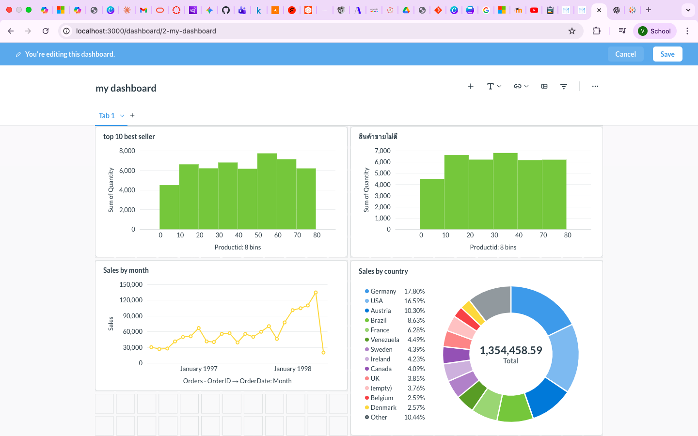

# LAB05 — Presto and Metabase Analytics

## Objective

This lab demonstrates how to:

* Create a Hive database for analytics
* Import relational data into Hive using Sqoop
* Query Hive data using Presto
* Install and configure Metabase
* Build business intelligence dashboards

---

# Technologies Used

* AWS EMR
* Hadoop HDFS
* Hive
* Sqoop
* Presto
* Metabase
* MySQL

---

# Part 1 — Environment Preparation

## Step 1.1 Create EMR Cluster

Create an EMR cluster using:

```text
Amazon EMR Release: emr-7.4.0
```

Applications:

```text
Core Hadoop
Sqoop
Presto
```

---

## Step 1.2 Verify Installed Services

```bash
presto-cli --version
```

```bash
sqoop version
```

```bash
hive --version
```

---

# Part 2 — Configure HDFS Replication

Presto performs better when HDFS replication is configured correctly.

---

## Step 2.1 Set Replication Factor

Login as root:

```bash
sudo su -
```

Edit:

```bash
vi /etc/hadoop/conf/hdfs-site.xml
```

Set:

```xml
<property>
    <name>dfs.replication</name>
    <value>2</value>
</property>
```

---

## Step 2.2 Restart NameNode

```bash
systemctl restart hadoop-hdfs-namenode
```

Exit root:

```bash
exit
```

---

# Part 3 — Install MySQL JDBC Driver

If JDBC was not installed previously, repeat the installation.

---

## Step 3.1 Download Driver

```bash
wget 
https://dev.mysql.com/get/Downloads/Connector-J/mysql-connector-java-5.1.49.tar.gz
```

---

## Step 3.2 Extract Driver

```bash
tar xvf mysql-connector-java-5.1.49.tar.gz
```

---

## Step 3.3 Install Driver

```bash
mkdir -p /usr/share/java
```

```bash
cp mysql-connector-java-5.1.49/mysql-connector-java-5.1.49.jar \
/usr/share/java
```

---

## Step 3.4 Create Symbolic Links

```bash
ln -sf \
/usr/share/java/mysql-connector-java-5.1.49.jar \
/usr/share/java/mysql-connector-java.jar
```

---

# Part 4 — Create Northwind Database in Hive

## Step 4.1 Start Hive

```bash
hive
```

---

## Step 4.2 Create Database

```sql
CREATE DATABASE northwind;
```

Verify:

```sql
SHOW DATABASES;
```

Expected:

```text
northwind
```

---

# Part 5 — Import Northwind Tables Using Sqoop

## Step 5.1 Import All Tables

```bash
sqoop import-all-tables \
--connect jdbc:mysql://clusterkit.ddns.net/northwind \
--username clusterkit \
-P \
--hive-import \
--create-hive-table \
-m 1 \
--hive-database northwind
```

Password:

```text
clusterkit2001
```

---

## Step 5.2 Verify Imported Tables

Start Hive:

```bash
hive
```

Execute:

```sql
USE northwind;

SHOW TABLES;
```

Expected tables:

```text
Categories
Customers
Employees
OrderDetails
Orders
Products
Region
Shippers
Suppliers
```

---

## Step 5.3 Verify Sample Data

```sql
SELECT * FROM Customers LIMIT 10;
```

Verify imported records are available.

---

# Part 6 — Query Data Using Presto

Presto is a distributed SQL query engine designed for interactive 
analytics.

---

## Step 6.1 Start Presto CLI

```bash
presto-cli --catalog hive --schema northwind
```

Expected prompt:

```text
presto:northwind>
```

---

## Step 6.2 Show Available Tables

```sql
SHOW TABLES;
```

Expected:

```text
Categories
Customers
Employees
OrderDetails
Orders
Products
Region
Shippers
Suppliers
```

---

## Step 6.3 Execute Sample Query

```sql
SELECT *
FROM Customers
LIMIT 10;
```

Verify returned records.

---

## Step 6.4 Compare Query Performance

Try the same query in:

```text
Hive
Presto
```

Observe execution time differences.

Presto is optimized for interactive analytics and usually returns results 
faster than Hive.

---

# Part 7 — Install Metabase

Metabase provides a web-based Business Intelligence platform.

---

## Step 7.1 Install Java

Install JDK 21.

Reference:

```text
https://www.oracle.com/java/technologies/downloads/#java21
```

Verify:

```bash
java -version
```

---

## Step 7.2 Configure JAVA_HOME

Linux / macOS:

```bash
echo $JAVA_HOME
```

Set variable if required:

```bash
export JAVA_HOME=/usr/share/java
```

---

## Step 7.3 Download Metabase

Download:

```text
metabase.jar
```

From:

```text
https://www.metabase.com/start/oss/jar
```

---

## Step 7.4 Start Metabase

```bash
cd Downloads
```

Run:

```bash
java --add-opens java.base/java.nio=ALL-UNNAMED -jar metabase.jar
```

---

## Step 7.5 Open Web Interface

Open browser:

```text
http://localhost:3000
```

Create the administrator account.

---

# Part 8 — Connect Metabase to Presto

---

## Step 8.1 Add Database

Navigate:

```text
Browse
→ Databases
→ Add Database
```

Select:

```text
Presto
```

---

## Step 8.2 Configure Connection

Use:

```text
Host     = [PRIMARY NODE IP]
Port     = 8889
Catalog  = hive
Schema   = northwind
Username = hadoop
Password = (leave blank)
```

Save configuration.

---

## Step 8.3 Verify Connection

Metabase should display:

```text
northwind
```

database tables successfully.

---

# Part 9 — Build Analytics Dashboard

---

## Dashboard 1 — Top 10 Best Sellers

Example query:

```sql
SELECT
    ProductID,
    SUM(Quantity) AS total_sales
FROM OrderDetails
GROUP BY ProductID
ORDER BY total_sales DESC
LIMIT 10;
```

Visualization:

```text
Bar Chart
```

---

## Dashboard 2 — Low Performance Products

Identify products with the lowest sales.

Visualization:

```text
Bar Chart
```

---

## Dashboard 3 — Monthly Sales Trend

Example:

```sql
SELECT
    month(OrderDate) AS month,
    SUM(Freight) AS sales
FROM Orders
GROUP BY month(OrderDate)
ORDER BY month;
```

Visualization:

```text
Line Chart
```

---

## Dashboard 4 — Sales by Country

Visualization:

```text
Pie Chart
```

---

# Part 10 — Screenshots

## Metabase Dashboard



---

Capture additional screenshots:

* Presto CLI
* Northwind Tables
* Database Connection
* Dashboard Builder
* Completed Dashboard

---

# Part 11 — Troubleshooting

## Error: Presto Connection Failed

Verify:

```bash
presto-cli --catalog hive --schema northwind
```

Check:

* Presto service running
* Hive catalog available
* Network connectivity

---

## Error: Database Not Found

Verify:

```sql
SHOW DATABASES;
```

Confirm:

```text
northwind
```

exists.

---

## Error: Metabase Cannot Connect

Verify:

```text
Host
Port
Catalog
Schema
```

configuration.

Ensure:

```text
Port 8889
```

is accessible.

---

## Error: No Tables Found

Verify:

```sql
SHOW TABLES;
```

inside Hive and Presto.

---

# Part 12 — Conclusion

In this lab, we learned how to:

* Import relational data into Hive using Sqoop
* Query Hive data through Presto
* Configure Metabase
* Connect Metabase to Presto
* Build business intelligence dashboards
* Visualize sales and operational metrics

Presto and Metabase provide a powerful analytics platform for large-scale 
data engineering projects.

---

# Author

Vikhom Manpiriya

Student ID: 66102010185

