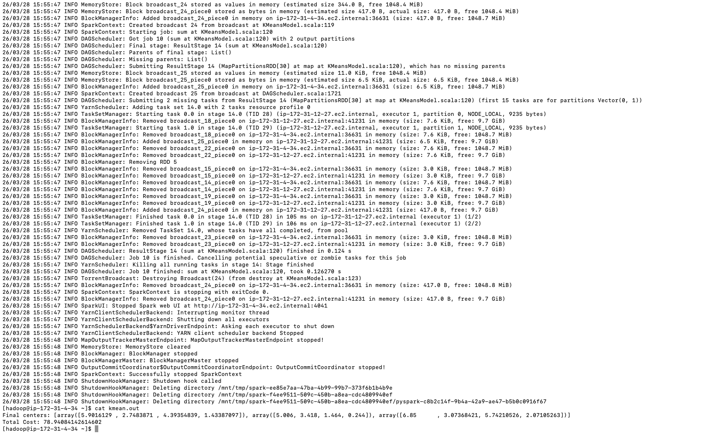
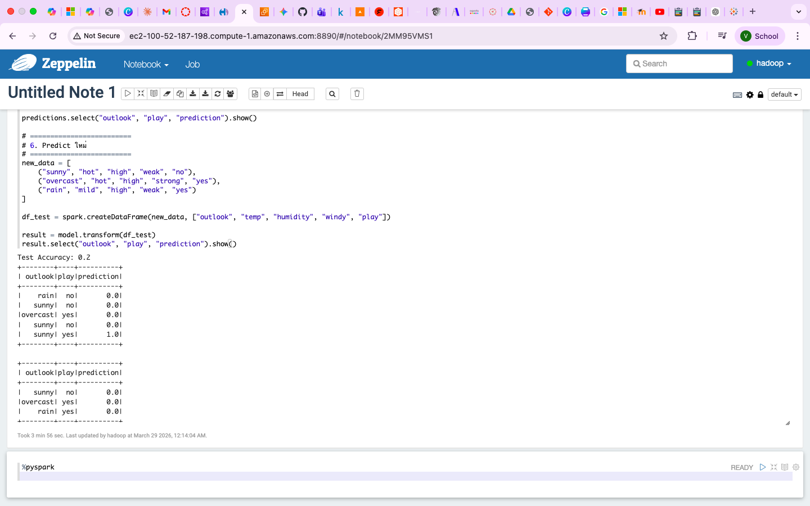
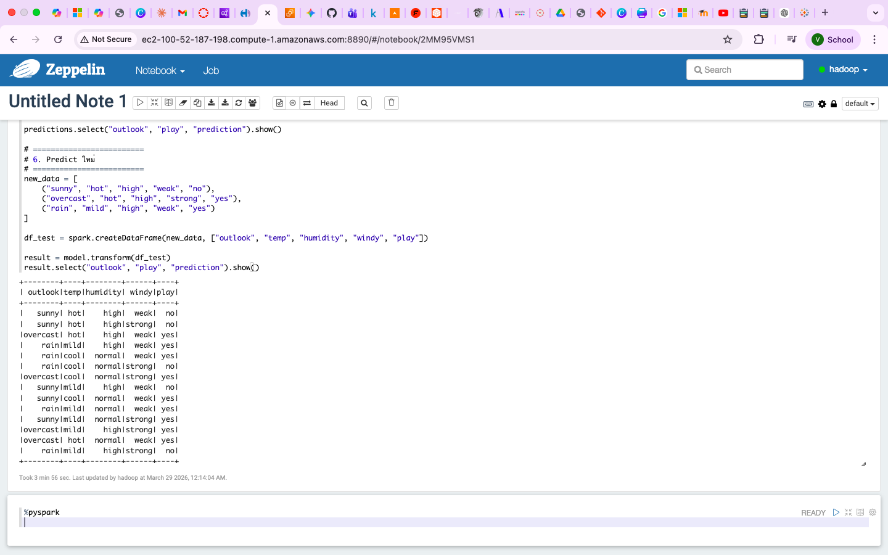

# LAB06 — Apache Spark & MLlib

## Objective

This lab introduces Apache Spark and Spark MLlib on AWS EMR.

Students will learn how to:

* Configure an EMR cluster with Spark and Zeppelin
* Use PySpark for distributed data processing
* Perform DataFrame operations
* Execute Spark SQL queries
* Train machine learning models using Spark MLlib
* Save and load trained models
* Integrate Spark with Hive
* Use Zeppelin notebooks for interactive analytics

---

# Technologies Used

* AWS EMR
* Apache Spark
* PySpark
* Spark MLlib
* Apache Zeppelin
* Hive
* Hadoop HDFS

---

# Part 1 — Environment Preparation

This lab requires an EMR cluster configured with Spark and Zeppelin.

Navigate to:

```text
AWS Console
→ Amazon EMR
→ Create Cluster
```

Configuration:

| Setting                 | Value           |
| ----------------------- | --------------- |
| EMR Release             | emr-7.x         |
| Application Bundle      | Core Hadoop     |
| Additional Applications | Spark, Zeppelin |
| Core Nodes              | 2               |
| EC2 Key Pair            | Your Key Pair   |

Create the cluster and wait until all nodes become available.

---

## Step 1.1 Connect to the Cluster

```bash
ssh -i ~/Downloads/bigdata.pem hadoop@[PRIMARY-NODE]
```

Verify Spark installation:

```bash
spark-submit --version
```

Verify PySpark:

```bash
pyspark --version
```

Verify Zeppelin service:

```bash
systemctl status zeppelin
```

---

# Part 2 — Spark Concepts

Apache Spark is a distributed computing framework designed for large-scale 
data processing.

Spark provides:

* Distributed execution
* In-memory processing
* Fault tolerance
* Machine learning support
* SQL processing

---

## Spark RDD

RDD stands for:

```text
Resilient Distributed Dataset
```

RDD characteristics:

* Immutable
* Distributed
* Fault tolerant
* Parallelizable

RDDs were the original abstraction used by Spark.

---

## Spark DataFrame

DataFrames provide:

* Schema support
* Optimized execution
* SQL compatibility
* Better performance than raw RDDs

Most modern Spark applications use DataFrames instead of RDDs.

---

# Part 3 — PySpark DataFrame Operations

## Step 3.1 Create Sample Data

Create:

```bash
vi salary.csv
```

Content:

```text
01,Joe,50000
02,Jean,80000
03,John,80000
04,Jim,18000
```

---

## Step 3.2 Upload File to HDFS

```bash
hadoop fs -put salary.csv
```

Verify:

```bash
hadoop fs -ls
```

---

## Step 3.3 Start PySpark

```bash
pyspark
```

---

## Step 3.4 Read CSV File

```python
df = spark.read.csv("salary.csv")
```

Display data:

```python
df.show()
```

---

## Step 3.5 Select Columns

Single column:

```python
df_selected = df.select("_c1")
df_selected.show()
```

Multiple columns:

```python
df_selected2 = df.select("_c1", "_c2")
df_selected2.show()
```

---

## Step 3.6 Filter Records

```python
df_filtered = df.filter(df["_c2"] > 50000)
df_filtered.show()
```

Count rows:

```python
df_filtered.count()
```

---

## Step 3.7 Rename Columns

```python
columns = ["id", "name", "salary"]

df = df.toDF(*columns)

df.show()
```

---

## Step 3.8 Create Temporary View

```python
df.createOrReplaceTempView("salary")
```

---

## Step 3.9 Execute SQL Query

```python
result = spark.sql(
    "SELECT * FROM salary WHERE salary > 50000"
)
```

Display:

```python
result.show()
```

---

## Step 3.10 Export CSV

```python
df.write.csv(
    "salary_header.csv",
    header=True
)
```

Exit PySpark:

```text
Ctrl + D
```

---

# Part 4 — Spark ML KMeans

Spark MLlib provides scalable machine learning algorithms.

This exercise uses the IRIS dataset and KMeans clustering.

---

## Step 4.1 Download Dataset

```bash
wget https://archive.ics.uci.edu/ml/machine-learning-databases/iris/iris.data
```

---

## Step 4.2 Prepare Dataset

Remove the final label column:

```bash
cut -f 1-4 -d , iris.data > iris.csv
```

Remove the blank line at the end of the file.

```bash
vi iris.csv
```

Press:

```text
G
dd
```

Save and exit.

---

## Step 4.3 Upload Dataset

```bash
hadoop fs -put iris.csv
```

Verify:

```bash
hadoop fs -ls
```

---

## Step 4.4 Download KMeans Example

Download the Spark MLlib KMeans example:

```bash
wget 
https://raw.githubusercontent.com/apache/spark/branch-2.4/examples/src/main/python/mllib/kmeans.py
```

Modify the delimiter used by the script:

Replace:

```python
line.split(' ')
```

With:

```python
line.split(',')
```

This allows the script to correctly parse the IRIS dataset.

---

## Step 4.5 Execute KMeans

Run:

```bash
spark-submit kmeans.py iris.csv 3 > kmean.out
```

The parameters are:

| Parameter | Description        |
| --------- | ------------------ |
| iris.csv  | Input dataset      |
| 3         | Number of clusters |

---

## Step 4.6 Install NumPy

Spark MLlib requires NumPy on all nodes.

Login as root:

```bash
sudo su -
```

Install:

```bash
yum install numpy
```

Repeat on all Core Nodes if required.

---

## Step 4.7 View Results

Display clustering output:

```bash
cat kmean.out
```

Expected output contains:

```text
Final centers:
...
```

Cluster centers represent the average values of each cluster.

---

# Part 5 — Save and Load KMeans Model

## Step 5.1 Save Model

Open:

```bash
vi kmeans.py
```

Before:

```python
sc.stop()
```

Insert:

```python
model.save(sc, "/user/hadoop/KMeansModel")
```

Save and exit.

---

## Step 5.2 Execute Again

```bash
spark-submit kmeans.py iris.csv 3 > kmean.out
```

---

## Step 5.3 Verify Model Directory

```bash
hadoop fs -ls
```

Expected:

```text
KMeansModel
```

---

## Step 5.4 Create Prediction Program

Create:

```bash
vi loadmodel.py
```

Insert:

```python
import numpy as np
from pyspark import SparkContext
from pyspark.mllib.clustering import KMeansModel

sc = SparkContext(appName="KMeans")

sameModel = KMeansModel.load(
    sc,
    "/user/hadoop/KMeansModel"
)

print(
    "Final centers: "
    + str(sameModel.clusterCenters)
)

print(
    sameModel.predict(
        np.array([5.1,1.5,1.1,0.5])
    )
)

sc.stop()
```

Save and exit.

---

## Step 5.5 Execute Prediction

```bash
spark-submit loadmodel.py > predict.out
```

Display:

```bash
cat predict.out
```

The output shows:

* Loaded cluster centers
* Predicted cluster ID

---

# Part 6 — Zeppelin Configuration

Apache Zeppelin provides a browser-based notebook environment for Spark.

---

## Step 6.1 Create Zeppelin Authentication

Login as root:

```bash
sudo su -
```

Navigate:

```bash
cd /etc/zeppelin/conf
```

Create configuration:

```bash
cp shiro.ini.template shiro.ini
```

---

## Step 6.2 Create User Account

Open:

```bash
vi shiro.ini
```

Locate:

```text
[users]
```

Add:

```text
hadoop = password, admin
```

Save and exit.

---

## Step 6.3 Restart Zeppelin

```bash
systemctl restart zeppelin
```

Verify:

```bash
systemctl status zeppelin
```

---

## Step 6.4 Configure User Impersonation

Open Zeppelin Web UI.

Navigate:

```text
Interpreter
→ Spark
→ Edit
```

Enable:

```text
Per User in isolated process
```

Enable:

```text
User Impersonate
```

Save configuration.

---

## Step 6.5 Create Notebook

Navigate:

```text
Notebook
→ Create New Notebook
```

Execute:

```python
%pyspark

df = spark.read.csv("salary.csv")

df.show()
```

Verify that the notebook successfully displays the dataset.

---

# Part 7 — Spark + Hive Integration

Spark can directly access Hive tables through the Hive Metastore.

This enables Spark SQL and Spark ML workloads to process data stored in Hive.

---

## Step 7.1 Create Hive Table

Start Hive:

```bash
hive
```

Create table:

```sql
CREATE EXTERNAL TABLE golf_csv (
    outlook STRING,
    temp STRING,
    humidity STRING,
    windy STRING,
    play STRING
)
ROW FORMAT DELIMITED
FIELDS TERMINATED BY ','
STORED AS TEXTFILE
LOCATION '/user/hadoop/golf_csv';
```

---

## Step 7.2 Create Input File

Create:

```bash
vi golf.csv
```

Insert:

```text
Sunny,Hot,High,Weak,No
Sunny,Hot,High,Strong,No
Overcast,Hot,High,Weak,Yes
Rain,Mild,High,Weak,Yes
Rain,Cool,Normal,Weak,Yes
Rain,Cool,Normal,Strong,No
Overcast,Cool,Normal,Strong,Yes
Sunny,Mild,High,Weak,No
Sunny,Cool,Normal,Weak,Yes
Rain,Mild,Normal,Weak,Yes
Sunny,Mild,Normal,Strong,Yes
Overcast,Mild,High,Strong,Yes
Overcast,Hot,Normal,Weak,Yes
Rain,Mild,High,Strong,No
```

---

## Step 7.3 Upload Data

```bash
hadoop fs -mkdir golf_csv

hadoop fs -put golf.csv golf_csv
```

---

## Step 7.4 Create Parquet Table

```sql
CREATE EXTERNAL TABLE golf_data (
    outlook STRING,
    temp STRING,
    humidity STRING,
    windy STRING,
    play STRING
)
STORED AS PARQUET
LOCATION '/user/hadoop/golf_data';
```

Insert data:

```sql
INSERT INTO golf_data
SELECT * FROM golf_csv;
```

---

# Part 8 — Decision Tree Classification

Spark MLlib provides classification algorithms such as Decision Trees.

---

## Step 8.1 Load Hive Table

```python
df = spark.table("golf_data")
```

Display:

```python
df.show()
```

---

## Step 8.2 Split Data

```python
train_df, test_df = df.randomSplit(
    [0.8, 0.2],
    seed=42
)
```

---

## Step 8.3 Import ML Components

```python
from pyspark.ml import Pipeline
from pyspark.ml.feature import (
    StringIndexer,
    VectorAssembler
)
from pyspark.ml.classification import (
    DecisionTreeClassifier
)
```

---

## Step 8.4 Create Label Indexer

```python
label_indexer = StringIndexer(
    inputCol="play",
    outputCol="label"
)
```

---

## Step 8.5 Create Feature Indexers

```python
outlook_indexer = StringIndexer(
    inputCol="outlook",
    outputCol="OutlookIndex"
)

temp_indexer = StringIndexer(
    inputCol="temp",
    outputCol="TempIndex"
)

humidity_indexer = StringIndexer(
    inputCol="humidity",
    outputCol="HumidityIndex"
)

windy_indexer = StringIndexer(
    inputCol="windy",
    outputCol="WindyIndex"
)
```

---

## Step 8.6 Assemble Features

```python
assembler = VectorAssembler(
    inputCols=[
        "OutlookIndex",
        "TempIndex",
        "HumidityIndex",
        "WindyIndex"
    ],
    outputCol="features"
)
```

---

## Step 8.7 Create Decision Tree

```python
dt = DecisionTreeClassifier(
    labelCol="label",
    featuresCol="features"
)
```

---

## Step 8.8 Create Pipeline

```python
pipeline = Pipeline(
    stages=[
        label_indexer,
        outlook_indexer,
        temp_indexer,
        humidity_indexer,
        windy_indexer,
        assembler,
        dt
    ]
)
```

---

## Step 8.9 Train Model

```python
model = pipeline.fit(train_df)
```

---

## Step 8.10 Generate Predictions

```python
predictions = model.transform(test_df)
```

---

## Step 8.11 Evaluate Accuracy

```python
from pyspark.ml.evaluation import (
    MulticlassClassificationEvaluator
)
```

```python
evaluator = MulticlassClassificationEvaluator(
    labelCol="label",
    predictionCol="prediction",
    metricName="accuracy"
)

accuracy = evaluator.evaluate(
    predictions
)

print(
    f"Test Accuracy: {accuracy:.2f}"
)
```

---

## Step 8.12 Predict New Records

```python
data = [
    ("Sunny","Hot","High","Weak","No"),
    ("Overcast","Hot","High","Strong","Yes"),
    ("Rain","Mild","High","Weak","Yes")
]
```

Create DataFrame:

```python
df_test = spark.createDataFrame(
    data,
    [
        "outlook",
        "temp",
        "humidity",
        "windy",
        "play"
    ]
)
```

Run prediction:

```python
predictions = model.transform(df_test)

predictions.select(
    "outlook",
    "play",
    "prediction"
).show()
```

---

# Part 9 — Hive Metastore Connection

Spark can connect directly to the Hive Metastore service.

Example:

```python
from pyspark.sql import SparkSession

spark = SparkSession \
    .builder \
    .enableHiveSupport() \
    .getOrCreate()
```

Verify:

```python
spark.sql(
    "SHOW DATABASES"
).show()
```

---

# Part 10 — Spark and Pandas

Convert Spark DataFrame to Pandas:

```python
pandas_df = df.limit(1000).toPandas()
```

Convert Pandas DataFrame back to Spark:

```python
spark_df = spark.createDataFrame(
    pandas_df
)
```

Spark also supports:

```python
import pyspark.pandas as ps
```

This API provides Pandas-like syntax on top of Spark.

---

# Part 11 — Screenshots

## KMeans Clustering



---

## Zeppelin Notebook



---

## Prediction Result



---

# Part 12 — Troubleshooting

## NumPy Not Installed

Error:

```text
ModuleNotFoundError: No module named numpy
```

Solution:

```bash
sudo su -

yum install numpy
```

---

## Hive Table Not Found

Verify:

```sql
SHOW TABLES;
```

Ensure the Hive table exists before running Spark jobs.

---

## Zeppelin Login Failed

Verify:

```bash
cat /etc/zeppelin/conf/shiro.ini
```

Ensure the user account is correctly configured.

---

# Part 13 — Conclusion

In this lab, we learned how to:

* Use PySpark DataFrames
* Execute Spark SQL queries
* Perform KMeans clustering
* Save and load ML models
* Configure Apache Zeppelin
* Access Hive data from Spark
* Train Decision Tree classifiers
* Integrate Spark with Pandas

Apache Spark provides a scalable platform for big data analytics and machine 
learning on Hadoop clusters.

---

# Author

Vikhom Manpiriya

Student ID: 66102010185

