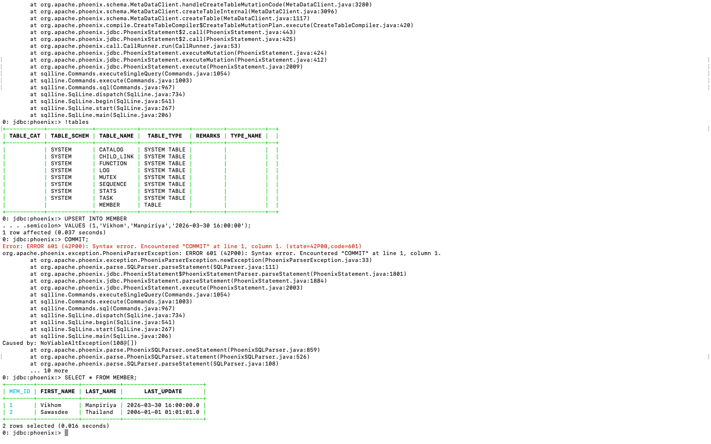

# LAB07 — HBase & Apache Phoenix

## Objective

This lab introduces Apache HBase and Apache Phoenix on AWS EMR.

Students will learn how to:

* Understand NoSQL concepts
* Use HBase Shell
* Create namespaces and tables
* Perform CRUD operations in HBase
* Manage HBase tables
* Query HBase using Apache Phoenix SQL
* Understand the relationship between HBase and Phoenix

---

# Technologies Used

* AWS EMR
* Apache HBase
* Apache Phoenix
* Hadoop HDFS
* SQLLine

---

# Architecture Overview

```text
Application
     │
     ▼
 Apache Phoenix
     │
     ▼
    HBase
     │
     ▼
    HDFS
```

---

# Part 1 — Environment Preparation

This lab requires an EMR cluster configured with:

* HBase
* Phoenix
* Spark

---

## Step 1.1 Create EMR Cluster

Navigate:

```text
AWS Console
→ Amazon EMR
→ Create Cluster
```

Configuration:

| Setting                 | Value                 |
| ----------------------- | --------------------- |
| EMR Release             | emr-7.x               |
| Application Bundle      | Core Hadoop           |
| Additional Applications | HBase, Phoenix, Spark |
| Core Nodes              | 2                     |

---

## Step 1.2 Fix HBase Logging Issue

Login as root:

```bash
sudo su -
```

Create log file:

```bash
touch /var/log/hbase/hbase.log
```

Set permissions:

```bash
chmod 777 /var/log/hbase/hbase.log

chmod 777 /var/log/hbase/SecurityAuth.audit
```

Return to hadoop user:

```bash
exit
```

---

# Part 2 — NoSQL Concepts

HBase is a NoSQL database built on top of Hadoop.

Unlike relational databases:

| Relational Database | HBase                 |
| ------------------- | --------------------- |
| Tables              | Tables                |
| Rows                | Rows                  |
| Columns             | Column Families       |
| SQL                 | HBase Shell / Phoenix |

---

## Key Characteristics

HBase provides:

* Distributed storage
* Horizontal scalability
* Fault tolerance
* High write throughput
* Integration with Hadoop

---

# Part 3 — HBase Shell Basics

Start HBase Shell:

```bash
hbase shell
```

Expected:

```text
hbase(main):001:0>
```

---

## Step 3.1 List Tables

```ruby
list
```

---

## Step 3.2 Current User

```ruby
whoami
```

---

## Step 3.3 Cluster Status

```ruby
status
```

---

## Step 3.4 HBase Version

```ruby
version
```

---

# Part 4 — Namespace Operations

Namespaces help organize HBase tables.

---

## Step 4.1 Create Namespace

```ruby
create_namespace 'dataswu'
```

Verify:

```ruby
list_namespace
```

---

## Step 4.2 Create Table Inside Namespace

```ruby
create 'dataswu:emp',
       'personal data',
       'professional data'
```

Insert record:

```ruby
put 'dataswu:emp',
    '1',
    'personal data:name',
    'Jo'
```

Verify:

```ruby
scan 'dataswu:emp'
```

---

# Part 5 — Table Creation

HBase stores data in tables consisting of rows and column families.

---

## Step 5.1 Create Table

Create a table named `emp`:

```ruby
create 'emp',
       'personal data',
       'professional data'
```

Verify:

```ruby
list
```

Expected:

```text
emp
```

---

## Step 5.2 Scan Empty Table

```ruby
scan 'emp'
```

Initially no rows will be displayed.

---

## Column Family Design

The table contains two column families:

```text
personal data
professional data
```

Examples:

```text
personal data:name
personal data:city

professional data:designation
professional data:salary
```

---

# Part 6 — CRUD Operations

CRUD stands for:

```text
Create
Read
Update
Delete
```

---

## Step 6.1 Insert Data

Insert employee information:

```ruby
put 'emp','1',
    'personal data:name',
    'raju'
```

```ruby
put 'emp','1',
    'personal data:city',
    'hyderabad'
```

```ruby
put 'emp','1',
    'professional data:designation',
    'manager'
```

```ruby
put 'emp','1',
    'professional data:salary',
    '50000'
```

---

## Step 6.2 View Data

```ruby
scan 'emp'
```

Expected output:

```text
ROW COLUMN+CELL
1 column=personal data:name,...
1 column=personal data:city,...
1 column=professional data:designation,...
1 column=professional data:salary,...
```

---

## Step 6.3 Update Data

Update city:

```ruby
put 'emp',
    '1',
    'personal data:city',
    'Delhi'
```

Verify:

```ruby
scan 'emp'
```

---

## Step 6.4 Retrieve Single Row

```ruby
get 'emp', '1'
```

Displays all columns belonging to row key 1.

---

## Step 6.5 Retrieve Specific Column

```ruby
get 'emp',
    '1',
    {
      COLUMN =>
      'personal data:name'
    }
```

Expected:

```text
raju
```

---

## Step 6.6 Delete Column

```ruby
delete 'emp',
       '1',
       'personal data:city'
```

Verify:

```ruby
scan 'emp'
```

The city column should no longer appear.

---

# Part 7 — Table Administration

HBase provides administrative commands for managing tables.

---

## Step 7.1 Describe Table

```ruby
describe 'emp'
```

Displays:

* Table name
* Column families
* Storage settings

---

## Step 7.2 Remove Column Family

```ruby
alter 'emp',
      'delete' =>
      'professional data'
```

Verify:

```ruby
scan 'emp'
```

Only the remaining column family should be displayed.

---

## Step 7.3 Count Records

```ruby
count 'emp'
```

Expected:

```text
1 row(s)
```

---

## Step 7.4 Disable Table

```ruby
disable 'emp'
```

Verify:

```ruby
is_disabled 'emp'
```

Expected:

```text
true
```

---

## Step 7.5 Enable Table

```ruby
enable 'emp'
```

Verify:

```ruby
is_enabled 'emp'
```

Expected:

```text
true
```

---

## Step 7.6 Check Existence

```ruby
exists 'emp'
```

Expected:

```text
Table emp does exist
```

---

# Part 8 — Table Removal

Removing a table requires disabling it first.

---

## Step 8.1 Truncate Table

```ruby
truncate 'emp'
```

This removes all records while preserving the table structure.

---

## Step 8.2 Disable Table

```ruby
disable 'emp'
```

---

## Step 8.3 Drop Table

```ruby
drop 'emp'
```

Verify:

```ruby
list
```

The table should no longer appear.

---

## Step 8.4 Exit HBase Shell

```ruby
exit
```

This returns the user to the Linux shell.

---

# Part 9 — Apache Phoenix

Apache Phoenix provides an SQL layer on top of HBase.

Instead of using HBase Shell commands, users can query HBase tables using SQL 
syntax.

---

## Phoenix Architecture

```text
Application
     │
     ▼
 Phoenix SQL
     │
     ▼
    HBase
     │
     ▼
    HDFS
```

---

## Step 9.1 Connect to Phoenix

Launch SQLLine:

```bash
sqlline.py localhost
```

Expected:

```text
sqlline>
```

---

## Step 9.2 Display Available Tables

```sql
!tables
```

This command displays all Phoenix tables accessible from the current 
connection.

---

## Step 9.3 Create Table

Example:

```sql
CREATE TABLE MEMBER (
    ID INTEGER NOT NULL PRIMARY KEY,
    FIRST_NAME VARCHAR,
    LAST_NAME VARCHAR,
    CREATED_DATE TIMESTAMP
);
```

---

## Step 9.4 Insert Data

Phoenix uses UPSERT instead of INSERT.

```sql
UPSERT INTO MEMBER VALUES
(
  1,
  'Vikhom',
  'Manpiriya',
  '2026-03-30 16:00:00'
);
```

Commit changes:

```sql
COMMIT;
```

---

## Step 9.5 Query Data

```sql
SELECT * FROM MEMBER;
```

Expected result:

```text
+----+-----------+------------+
| ID | FIRSTNAME | LASTNAME   |
+----+-----------+------------+
| 1  | Vikhom    | Manpiriya  |
+----+-----------+------------+
```

---

## Step 9.6 Exit Phoenix

```sql
!quit
```

---

## HBase vs Phoenix

| Feature        | HBase    | Phoenix       |
| -------------- | -------- | ------------- |
| Interface      | Shell    | SQL           |
| Query Language | Commands | ANSI-like SQL |
| Learning Curve | Higher   | Easier        |
| Analytics      | Limited  | Better        |

Phoenix simplifies interaction with HBase by providing familiar SQL 
operations.

---

# Part 10 — Screenshots

The following screenshot was captured during the lab execution.

## Phoenix Query Result



---

The screenshot demonstrates:

* Successful Phoenix connection
* Table access
* SQL query execution
* Result visualization

---

# Part 11 — Troubleshooting

## HBase Shell Not Found

Verify installation:

```bash
which hbase
```

Check:

```bash
hbase version
```

---

## HBase Service Not Running

Check status:

```bash
jps
```

Expected services include:

```text
HMaster
HRegionServer
```

---

## Phoenix Connection Failed

Verify:

```bash
sqlline.py localhost
```

Confirm that HBase services are running before connecting.

---

## Table Does Not Exist

Verify available tables:

```sql
!tables
```

or

```ruby
list
```

depending on whether Phoenix or HBase Shell is being used.

---

## Permission Errors

Verify current user:

```bash
whoami
```

Expected:

```text
hadoop
```

---

# Part 12 — Conclusion

In this lab, we learned how to:

* Understand NoSQL database concepts
* Use HBase Shell commands
* Create namespaces and tables
* Insert, update, retrieve, and delete data
* Manage HBase tables
* Use Apache Phoenix as an SQL layer
* Query HBase using SQL syntax

HBase provides scalable distributed storage, while Phoenix offers a 
convenient SQL interface for querying and managing data stored in HBase.

---

# Author

Vikhom Manpiriya

Student ID: 66102010185

