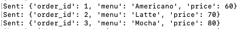
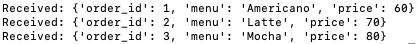
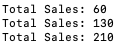

# LAB08 — ODBC/JDBC & Apache Kafka

## Objective

This lab introduces database connectivity technologies and Apache Kafka for 
real-time event streaming.

Students will learn how to:

* Create Hive tables
* Import data using Sqoop
* Configure JDBC and ODBC connectivity
* Connect Hive to external tools
* Understand Kafka architecture
* Create Kafka topics
* Use producers and consumers
* Understand consumer groups and offsets
* Build Kafka applications using Python
* Configure Kafka authentication using SASL

---

# Technologies Used

* AWS EMR
* Hive
* Sqoop
* MySQL JDBC
* ODBC
* DBeaver
* Power BI
* Apache Kafka
* Python
* SASL Authentication

---

# Part 1 — Environment Preparation

## Step 1.1 Create EMR Cluster

Applications:

* Core Hadoop
* Sqoop
* Oozie

---

# Part 2 — Hive Product Table Setup

## Step 2.1 Create Products Table

```sql
CREATE EXTERNAL TABLE products (
    productid INT,
    productname STRING,
    supplierid INT,
    categoryid INT,
    quantityperunit STRING,
    unitprice DOUBLE,
    unitsinstock INT,
    unitsonorder INT,
    reorderlevel INT,
    discontinued BOOLEAN
)
ROW FORMAT DELIMITED
FIELDS TERMINATED BY ','
STORED AS TEXTFILE
LOCATION '/user/hadoop/products';
```

## Step 2.2 Verify Table

```sql
SHOW TABLES;
DESC products;
```

---

# Part 3 — Secure Password File

## Step 3.1 Create Password File

```bash
echo -n "clusterkit2001" > .password
```

## Step 3.2 Upload to HDFS

```bash
hadoop fs -put .password
```

## Step 3.3 Secure Permissions

```bash
hadoop fs -chmod 600 .password
```

---

# Part 4 — Install MySQL JDBC Driver

## Step 4.1 Download Driver

```bash
wget https://dev.mysql.com/get/Downloads/Connector-J/mysql-connector-java-5.1.49.tar.gz
```

## Step 4.2 Extract Package

```bash
tar xvf mysql-connector-java-5.1.49.tar.gz
```

## Step 4.3 Copy Driver

```bash
cp mysql-connector-java-5.1.49/mysql-connector-java-5.1.49.jar /usr/share/java
```

## Step 4.4 Configure Sqoop JDBC

```bash
ln -sf /usr/share/java/mysql-connector-java-5.1.49.jar /usr/share/java/mysql-connector-java.jar
```

## Step 4.5 Update Oozie Sharelib

```bash
sudo -u oozie hadoop fs -put /usr/share/java/mysql-connector-java.jar /usr/oozie/share/lib/*/sqoop/
```

## Step 4.6 Restart Oozie

```bash
systemctl restart oozie
```

---

# Part 5 — Sqoop Import

## Step 5.1 Import Products Table

```bash
import --connect jdbc:mysql://clusterkit.ddns.net/northwind \
--username clusterkit \
--password-file .password \
--table Products \
--append \
--target-dir /user/hadoop/products
```

## Step 5.2 Verify Hive Data

```sql
SELECT * FROM products LIMIT 10;
```

---

# Part 6 — JDBC Concepts

## What is JDBC

Java Database Connectivity (JDBC) is a standard API that enables Java 
applications to communicate with databases.

### JDBC Architecture

Application
↓
JDBC Driver
↓
Database

### Benefits

* Database independence
* Standard API
* Secure connectivity

---

# Part 7 — ODBC Concepts

## What is ODBC

Open Database Connectivity (ODBC) allows applications to connect to different 
databases using a common interface.

### ODBC Architecture

Application
↓
ODBC Driver
↓
Database

### Benefits

* Platform independence
* Tool integration
* Business intelligence support

---

# Part 8 — DBeaver and Power BI Connectivity

## DBeaver

### Install DBeaver

### Configure JDBC Connection

Host:
Port:
Database:

### Verify Connection

---

## Power BI

### Install Hive ODBC Driver

### Configure DSN

### Connect via ODBC

---

## Microsoft Excel

### Data → Get Data → ODBC

---

# Part 9 — Apache Kafka Fundamentals

## What is Apache Kafka

Apache Kafka is a distributed event streaming platform.

---

## Kafka Components

### Producer

Sends messages.

### Consumer

Reads messages.

### Topic

Stores messages.

### Partition

Enables parallel processing.

### Broker

Kafka server.

---

# Part 10 — Consumer Groups and Offsets

## Offset

An offset is a unique position of a message inside a partition.

Example:

Offset 0
Offset 1
Offset 2

---

## Group ID

A consumer group shares work across consumers.

---

## Benefits

* Fault tolerance
* Scalability
* Recovery after failure

---
# Part 11 — Kafka Installation

## Step 11.1 Download Kafka

Download Apache Kafka package.

```bash
cd /mnt

wget https://dlcdn.apache.org/kafka/4.2.0/kafka_2.13-4.2.0.tgz
```

---

## Step 11.2 Extract Package

Extract the Kafka package.

```bash
tar xvf kafka_2.13-4.2.0.tgz

cd kafka_2.13-4.2.0/
```

---

## Step 11.3 Configure Java

Kafka 4.2.0 requires Java 17 or later.

Check available Java versions:

```bash
sudo alternatives --config java
```

Select:

```text
/usr/lib/jvm/java-21-amazon-corretto.x86_64/bin/java
```

Verify:

```bash
java -version
```

---

## Step 11.4 Format Kafka Storage

Generate a Kafka Cluster ID.

```bash
KAFKA_CLUSTER_ID="$(bin/kafka-storage.sh random-uuid)"
```

Save the Cluster ID.

```bash
echo $KAFKA_CLUSTER_ID > kafka_cluster_id
```

Format Kafka storage.

```bash
bin/kafka-storage.sh format \
--standalone \
-t $KAFKA_CLUSTER_ID \
-c config/server.properties
```

---

## Step 11.5 Start Kafka Server

Start Kafka in foreground mode.

```bash
bin/kafka-server-start.sh config/server.properties
```

To run Kafka in background mode:

```bash
bin/kafka-server-start.sh -daemon config/server.properties
```

Verify process:

```bash
ps -ef | grep kafka
```

---

# Part 12 — Kafka Topics

## Create Topic

Create a topic named quickstart-events.

```bash
bin/kafka-topics.sh \
--create \
--topic quickstart-events \
--bootstrap-server localhost:9092
```

Expected:

```text
Created topic quickstart-events
```

---

## List Topics

```bash
bin/kafka-topics.sh \
--list \
--bootstrap-server localhost:9092
```

Expected:

```text
quickstart-events
```

---

## Topic Architecture

```text
Producer
    │
    ▼
Topic (quickstart-events)
    │
 ┌──┴──┐
 ▼     ▼
Partition 0
Partition 1
    │
    ▼
Consumers
```

Topics are divided into partitions to support scalability and parallel 
processing.

---

# Part 13 — Producer and Consumer

## Producer

Open a terminal and start a producer.

```bash
bin/kafka-console-producer.sh \
--topic quickstart-events \
--bootstrap-server localhost:9092
```

Enter sample messages:

```text
Hello Kafka
Message 1
Message 2
```

---

## Consumer

Open another terminal.

```bash
bin/kafka-console-consumer.sh \
--topic quickstart-events \
--from-beginning \
--bootstrap-server localhost:9092
```

Expected output:

```text
Hello Kafka
Message 1
Message 2
```

---

## Consumer Groups

Kafka supports consumer groups for workload sharing.

```bash
bin/kafka-console-consumer.sh \
--topic quickstart-events \
--group my-monitor-group \
--bootstrap-server localhost:9092
```

---

## Offset Concept

Each message inside a partition receives an offset.

Example:

```text
Offset 0
Offset 1
Offset 2
Offset 3
```

Kafka stores offsets separately for each consumer group.

Example:

```text
Group A -> Offset 10
Group B -> Offset 35
```

Each group can consume messages independently.

---

# Part 14 — Python Kafka Consumer

## Install Kafka Python Library

```bash
pip install kafka-python
```

---

## Create Consumer Program

Create a file named kafka-python.py.

```python
from kafka import KafkaConsumer
from kafka.errors import KafkaError

bootstrap_servers = ['localhost:9092']
topic = 'quickstart-events'

consumer = KafkaConsumer(
    topic,
    bootstrap_servers=bootstrap_servers,
    group_id='consumer-group',
    auto_offset_reset='earliest'
)

try:
    for message in consumer:
        print(
            f"Received message: "
            f"{message.value.decode('utf-8')}"
        )

except KafkaError as e:
    print(f"Error occurred: {e}")

finally:
    consumer.close()
```

---

## Run Consumer

```bash
python kafka-python.py
```

Expected:

```text
Received message: Hello Kafka
Received message: Message 1
Received message: Message 2
```

---

# Part 15 — Kafka Security (SASL)

## SASL Overview

SASL (Simple Authentication and Security Layer) provides authentication and 
access control for Kafka clients.

---

## Configure Kafka Server

Edit:

```bash
vi config/server.properties
```

Modify:

```properties
listeners=SASL_PLAINTEXT://:9092,CONTROLLER://:9093

security.inter.broker.protocol=SASL_PLAINTEXT

sasl.mechanism.inter.broker.protocol=PLAIN

sasl.enabled.mechanisms=PLAIN

advertised.listeners=SASL_PLAINTEXT://localhost:9092
```

---

## Create JAAS Configuration

Create:

```bash
vi config/kafka_server_jaas.conf
```

Add:

```text
KafkaServer {
    org.apache.kafka.common.security.plain.PlainLoginModule required
    serviceName="kafka"
    username="admin"
    password="admin-secret"
    user_admin="admin-secret"
    user_alice="alice-secret"
    user_kittirak="iloveyou";
};
```

---

## Configure Environment Variable

```bash
export 
KAFKA_OPTS="-Djava.security.auth.login.config=/mnt/kafka_2.13-4.2.0/config/kafka_server_jaas.conf"
```

---

## Restart Kafka

```bash
bin/kafka-server-stop.sh
```

```bash
bin/kafka-server-start.sh -daemon config/server.properties
```

---

## Configure Client Authentication

Create:

```bash
vi config/client.properties
```

Add:

```properties
security.protocol=SASL_PLAINTEXT

sasl.mechanism=PLAIN

sasl.jaas.config=org.apache.kafka.common.security.plain.PlainLoginModule 
required username="alice" password="alice-secret";
```

---

## Create Secure Topic

```bash
bin/kafka-topics.sh \
--create \
--topic weather-ki-station \
--bootstrap-server localhost:9092 \
--command-config config/client.properties
```

---

## Secure Producer

```bash
bin/kafka-console-producer.sh \
--topic quickstart-events \
--bootstrap-server localhost:9092 \
--producer.config config/client.properties
```

---

## Secure Consumer

```bash
bin/kafka-console-consumer.sh \
--topic quickstart-events \
--from-beginning \
--bootstrap-server localhost:9092 \
--consumer.config config/client.properties
```

Authentication is now required before clients can access Kafka resources.

---

# Part 16 — Screenshots

## Producer Output



---

## Consumer Output



---

## Analytics Output



---

# Part 17 — Troubleshooting

## JDBC Driver Not Found

### Solution

Reinstall MySQL JDBC driver.

---

## Sqoop Import Failed

### Solution

Verify credentials and JDBC configuration.

---

## Kafka Server Not Starting

### Solution

Check Java version.

```bash
java -version
```

---

## Consumer Not Receiving Messages

### Solution

Verify:

* Topic name
* Bootstrap server
* Group ID

---

## SASL Authentication Failed

### Solution

Verify:

* JAAS configuration
* Username
* Password

---

# Part 18 — Conclusion

In this lab, we learned how to:

* Connect Hive using JDBC and ODBC
* Import data using Sqoop
* Configure DBeaver and Power BI
* Understand Kafka architecture
* Create topics and stream data
* Use consumer groups and offsets
* Build Kafka consumers using Python
* Secure Kafka using SASL

These technologies form the foundation of modern data engineering pipelines 
and real-time event streaming systems.

---

# Author

Vikhom Manpiriya

Student ID: 66102010185

