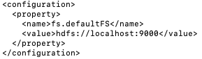
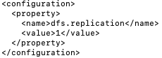
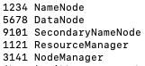

#LAB10 — Hadoop Cluster Installation with Ambari and ODP

##Objective

This lab demonstrates the deployment of a multi-node Hadoop cluster using:

-Rocky Linux 9
-VirtualBox
-ZeroTier
-Apache Ambari
-Open Data Platform (ODP)
-HDFS
-YARN
-Hive
-Ranger
-Oozie
-Hue

Students learn how to build and manage a distributed Hadoop platform from 
scratch.

---

#Technologies Used

-Rocky Linux 9
-VirtualBox
-ZeroTier
-OpenSSH
-MariaDB
-MySQL JDBC
-Apache Ambari
-Open Data Platform (ODP)
-Apache Hadoop
-HDFS
-YARN

---

# Part 1 — Lab Overview

## Overview

This lab demonstrates how to build a complete Hadoop cluster from scratch
using Rocky Linux, Apache Ambari, and Open Data Platform (ODP).

Unlike previous labs that used Amazon EMR, this workshop focuses on a
self-managed Hadoop environment where every component must be installed,
configured, and maintained manually.

Students will learn how to:

- Prepare Linux servers
- Configure network connectivity
- Install Ambari
- Deploy Hadoop services
- Manage HDFS and YARN
- Verify cluster health
- Troubleshoot installation issues

The final result is a fully functional multi-node Hadoop cluster.

---

## Learning Objectives

After completing this lab, students should be able to:

- Understand Hadoop cluster architecture
- Configure Linux hosts for distributed systems
- Install Ambari management platform
- Deploy Hadoop ecosystem services
- Verify cluster operations
- Troubleshoot common deployment problems

---

# Part 2 — Cluster Architecture

## Overview

The Hadoop cluster consists of multiple Linux virtual machines connected
through a virtual network.

Each node performs a specific role within the cluster.

---

## Example Architecture

```text
                    +----------------+
                    | Ambari Server  |
                    | master1        |
                    +--------+-------+
                             |
                             |
        -----------------------------------------
        |                  |                    |
        |                  |                    |
+-------+------+   +-------+------+   +--------+------+
| Worker Node 1|   | Worker Node 2|   | Worker Node 3 |
| data1        |   | data2        |   | data3         |
+--------------+   +--------------+   +--------------+

        Hadoop Distributed File System (HDFS)
        Yet Another Resource Negotiator (YARN)
```

---

## Why Multiple Nodes?

A distributed Hadoop cluster provides:

- Scalability
- Fault tolerance
- Parallel processing
- High availability

Data can be replicated across multiple nodes to prevent data loss.

---

## Core Components

### HDFS

HDFS (Hadoop Distributed File System) is responsible for storing files
across multiple machines.

Key services:

- NameNode
- DataNode

---

### YARN

YARN (Yet Another Resource Negotiator) manages cluster resources and
application execution.

Key services:

- ResourceManager
- NodeManager

---

### Ambari

Apache Ambari provides:

- Cluster deployment
- Configuration management
- Monitoring
- Service management

Ambari greatly simplifies Hadoop administration.

---

# Part 3 — Virtual Machine Preparation

## Overview

Before installing Hadoop, multiple Linux virtual machines must be created.

Rocky Linux 9 is recommended for this workshop.

---

## Recommended Hardware

Minimum requirements per virtual machine:

| Component | Recommended |
|------------|------------|
| CPU | 2 vCPU |
| Memory | 4 GB |
| Disk | 40 GB |
| OS | Rocky Linux 9 |

---

## Virtual Machine Layout

Example:

| Hostname | Role |
|-----------|------|
| master1 | Ambari Server |
| data1 | Worker Node |
| data2 | Worker Node |
| data3 | Worker Node |

---

## Verify Connectivity

Verify that every node can communicate with each other.

Example:

```bash
ping master1
```

```bash
ping data1
```

```bash
ping data2
```

```bash
ping data3
```

Expected result:

```text
64 bytes from ...
```

All nodes should be reachable before continuing.

---

# Part 4 — ZeroTier Network Setup

## Overview

ZeroTier is used to connect all virtual machines through a virtual
software-defined network.

This allows machines running on different computers to communicate as if
they were on the same local network.

---

## Why ZeroTier?

Benefits include:

- Simplified networking
- Private virtual network
- Easy cluster deployment
- Cross-platform support

---

## Step 4.1 Create ZeroTier Account

Open:

https://www.zerotier.com

Create an account and sign in.

---

## Step 4.2 Create a Network

From the ZeroTier dashboard:

1. Select Create Network
2. Copy the generated Network ID
3. Save the Network ID for later use

---

## Step 4.3 Install ZeroTier

Run on every node:

```bash
curl -s https://install.zerotier.com | sudo bash
```

---

## Step 4.4 Join Network

Replace NETWORK_ID with your own value.

```bash
sudo zerotier-cli join NETWORK_ID
```

Example:

```bash
sudo zerotier-cli join 8056c2e21c000001
```

---

## Step 4.5 Verify Connection

Check status:

```bash
sudo zerotier-cli listnetworks
```

Expected output:

```text
OK
```

---

# Part 5 — Configure Hostnames

## Overview

Each node must have a unique Fully Qualified Domain Name (FQDN).

Using consistent hostnames simplifies Hadoop service discovery.

---

## Configure Master Node

Example:

```bash
sudo hostnamectl set-hostname master1.example.com
```

Verify:

```bash
hostname
```

---

## Configure Worker Nodes

Examples:

```bash
sudo hostnamectl set-hostname data1.example.com
```

```bash
sudo hostnamectl set-hostname data2.example.com
```

```bash
sudo hostnamectl set-hostname data3.example.com
```

---

## Verify Hostnames

```bash
hostname -f
```

Expected:

```text
master1.example.com
```

or

```text
data1.example.com
```

depending on the node.

---

# Part 6 — Configure Hosts File

## Overview

Hostname resolution must work before Ambari installation.

Every node should be able to resolve all cluster hostnames.

---

## Edit Hosts File

```bash
sudo vi /etc/hosts
```

Example:

```text
10.147.17.10 master1.example.com master1
10.147.17.11 data1.example.com data1
10.147.17.12 data2.example.com data2
10.147.17.13 data3.example.com data3
```

Replace IP addresses with actual ZeroTier addresses.

---

## Verify Resolution

```bash
ping master1
```

```bash
ping data1
```

```bash
ping data2
```

```bash
ping data3
```

Expected:

```text
PING master1.example.com
```

All hostnames should resolve successfully.

---

# Part 7 — SSH Key Distribution

## Overview

Apache Ambari installs software and executes administrative commands on
remote hosts through SSH.

To allow Ambari to communicate with all cluster nodes without repeatedly
requesting passwords, SSH key-based authentication must be configured.

Passwordless SSH is one of the most important prerequisites before
deploying a Hadoop cluster.

---

## Step 7.1 Generate SSH Key Pair

Generate an RSA key pair on the Ambari server node.

```bash
ssh-keygen -t rsa -b 4096
```

Press Enter to accept the default location.

Example:

```text
Generating public/private rsa key pair.
Your identification has been saved in:
~/.ssh/id_rsa
```

---

## Step 7.2 Verify Generated Keys

List the contents of the SSH directory.

```bash
ls -lah ~/.ssh
```

Expected:

```text
id_rsa
id_rsa.pub
```

The private key must remain confidential and should never be shared.

---

## Step 7.3 Copy Public Key to Cluster Nodes

Copy the public key to every node in the cluster.

Example:

```bash
ssh-copy-id root@master1.example.com
```

```bash
ssh-copy-id root@data1.example.com
```

```bash
ssh-copy-id root@data2.example.com
```

```bash
ssh-copy-id root@data3.example.com
```

Enter the remote password when prompted.

---

## Step 7.4 Test Passwordless SSH

Verify that login no longer requires a password.

```bash
ssh data1.example.com
```

Expected:

```text
Last login ...
```

The system should log in directly without asking for a password.

Repeat the verification for all cluster nodes.

---

## Why Passwordless SSH Is Required

Apache Ambari uses SSH to:

* Install software packages
* Configure services
* Distribute configuration files
* Start and stop Hadoop services
* Execute administrative commands

Without passwordless SSH, Ambari cannot automate cluster deployment.

---

# Part 8 — Disable SELinux

## Overview

Security-Enhanced Linux (SELinux) provides mandatory access control for
Linux systems.

Although SELinux improves system security, it may interfere with Hadoop,
Ambari, and related services during installation.

For laboratory environments, SELinux is typically disabled before cluster
deployment.

---

## Step 8.1 Check SELinux Status

Verify the current SELinux mode.

```bash
getenforce
```

Example:

```text
Enforcing
```

---

## Step 8.2 Temporarily Disable SELinux

```bash
sudo setenforce 0
```

Verify:

```bash
getenforce
```

Expected:

```text
Permissive
```

---

## Step 8.3 Disable SELinux Permanently

Edit the SELinux configuration file.

```bash
sudo vi /etc/selinux/config
```

Locate:

```text
SELINUX=enforcing
```

Change to:

```text
SELINUX=disabled
```

Save and exit.

---

## Step 8.4 Reboot System

```bash
sudo reboot
```

After reboot, verify:

```bash
getenforce
```

Expected:

```text
Disabled
```

---

# Part 9 — Configure Time Synchronization

## Overview

Distributed systems require synchronized clocks.

Time differences between nodes can cause authentication failures,
Kerberos issues, and service instability.

Chrony is commonly used to synchronize system time.

---

## Step 9.1 Install Chrony

```bash
sudo dnf install chrony -y
```

---

## Step 9.2 Enable Chrony

```bash
sudo systemctl enable chronyd
```

```bash
sudo systemctl start chronyd
```

---

## Step 9.3 Verify Service Status

```bash
systemctl status chronyd
```

Expected:

```text
active (running)
```

---

## Step 9.4 Verify Time Sources

```bash
chronyc sources
```

The output should display active time synchronization sources.

---

## Why Time Synchronization Is Important

Accurate time is required for:

* Kerberos authentication
* Ambari management
* Hadoop services
* Cluster monitoring

---

# Part 10 — Install Required Packages

## Overview

Several operating system packages are required before Ambari and Hadoop
installation.

---

## Step 10.1 Update System

```bash
sudo dnf update -y
```

---

## Step 10.2 Install Utilities

```bash
sudo dnf install -y \
wget \
curl \
tar \
unzip \
vim \
git \
python3
```

---

## Step 10.3 Verify Python

```bash
python3 --version
```

Example:

```text
Python 3.x.x
```

---

## Step 10.4 Verify Java

```bash
java -version
```

Verify that Java is installed correctly before continuing.

---

# Part 11 — Install MariaDB

## Overview

Apache Ambari and Hadoop ecosystem services store metadata in relational
databases.

MariaDB is commonly used as the backend database server.

---

## Step 11.1 Install MariaDB

```bash
sudo dnf install mariadb-server -y
```

---

## Step 11.2 Enable MariaDB

```bash
sudo systemctl enable mariadb
```

```bash
sudo systemctl start mariadb
```

---

## Step 11.3 Verify Service

```bash
systemctl status mariadb
```

Expected:

```text
active (running)
```

---

## Step 11.4 Secure Installation

```bash
sudo mysql_secure_installation
```

Recommended actions:

* Set root password
* Remove anonymous users
* Disable remote root login
* Remove test database

---

## Step 11.5 Test Database Access

```bash
mysql -u root -p
```

Expected:

```text
MariaDB [(none)]>
```

---

# Part 12 — Install MySQL JDBC Driver

## Overview

Ambari and Hadoop services require JDBC drivers to communicate with
MariaDB databases.

---

## Step 12.1 Download JDBC Driver

```bash
wget 
https://dev.mysql.com/get/Downloads/Connector-J/mysql-connector-java-5.1.49.tar.gz
```

---

## Step 12.2 Extract Archive

```bash
tar xvf mysql-connector-java-5.1.49.tar.gz
```

---

## Step 12.3 Copy JDBC Driver

```bash
sudo cp \
mysql-connector-java-5.1.49/mysql-connector-java-5.1.49.jar \
/usr/share/java
```

---

## Step 12.4 Create Symbolic Link

```bash
sudo ln -sf \
/usr/share/java/mysql-connector-java-5.1.49.jar \
/usr/share/java/mysql-connector-java.jar
```

---

## Step 12.5 Verify Driver

```bash
ls -lah /usr/share/java/mysql-connector-java*
```

Expected:

```text
mysql-connector-java.jar
```

The JDBC driver is now available for Ambari and Hadoop services.

---

# Part 13 — Configure Hadoop XML Files

## Overview

Apache Hadoop stores its configuration settings in XML files.

These files define how Hadoop services communicate, where data is stored,
and how the distributed file system behaves.

In this lab, two primary configuration files are used:

* core-site.xml
* hdfs-site.xml

---

## Step 13.1 Configure core-site.xml

Edit the file:

```bash
vi $HADOOP_HOME/etc/hadoop/core-site.xml
```

Example configuration:

```xml
<configuration>
  <property>
    <name>fs.defaultFS</name>
    <value>hdfs://localhost:9000</value>
  </property>
</configuration>
```

---

## Understanding fs.defaultFS

The property:

```xml
<name>fs.defaultFS</name>
```

defines the default Hadoop Distributed File System endpoint.

Value:

```text
hdfs://localhost:9000
```

means Hadoop clients communicate with a NameNode running on the local
machine using port 9000.

---

## Step 13.2 Configure hdfs-site.xml

Edit:

```bash
vi $HADOOP_HOME/etc/hadoop/hdfs-site.xml
```

Example configuration:

```xml
<configuration>
  <property>
    <name>dfs.replication</name>
    <value>1</value>
  </property>
</configuration>
```

---

## Understanding dfs.replication

The property:

```xml
<name>dfs.replication</name>
```

controls the number of block replicas stored by HDFS.

Value:

```text
1
```

indicates that only one copy of each data block is stored.

This setting is appropriate for a single-node laboratory environment.

In production clusters, replication factors of 2 or 3 are commonly used.

---

## Configuration Summary

| Property        | Value                 | Description                   |
| --------------- | --------------------- | ----------------------------- |
| fs.defaultFS    | hdfs://localhost:9000 | Default NameNode endpoint     |
| dfs.replication | 1                     | Number of HDFS block replicas |

---

## Configuration Screenshots

### core-site.xml



---

### hdfs-site.xml



---

## Verify Configuration Files

Display configuration contents:

```bash
cat $HADOOP_HOME/etc/hadoop/core-site.xml
```

```bash
cat $HADOOP_HOME/etc/hadoop/hdfs-site.xml
```

Verify that the values match the intended Hadoop deployment.

---

# Part 14 — Format the NameNode

## Overview

Before Hadoop can store data in HDFS, the NameNode metadata directory
must be initialized.

Formatting the NameNode creates the filesystem metadata structures used
by HDFS.

This operation is typically performed only once during the initial setup.

---

## Step 14.1 Format NameNode

Run:

```bash
hdfs namenode -format
```

Example output:

```text
Storage directory has been successfully formatted.
```

---

## Step 14.2 Verify Metadata Directories

Check the configured NameNode storage location.

Example:

```bash
ls -lah ~/hadoopdata/hdfs/namenode
```

Expected:

```text
current
VERSION
seen_txid
```

These files contain HDFS metadata information.

---

## Important Notes

Do not repeatedly format the NameNode on a production system.

Formatting removes existing filesystem metadata and may result in data
loss.

For this laboratory environment, formatting is performed only during
initial deployment.

---

# Part 15 — Start Hadoop Services

## Overview

After configuration and formatting are complete, Hadoop services can be
started.

The Hadoop platform consists of:

* HDFS services
* YARN services

---

## Step 15.1 Start HDFS

```bash
start-dfs.sh
```

Expected services:

* NameNode
* DataNode
* SecondaryNameNode

---

## Step 15.2 Start YARN

```bash
start-yarn.sh
```

Expected services:

* ResourceManager
* NodeManager

---

## Step 15.3 Verify Startup Logs

Review startup messages for errors.

Example:

```text
Starting namenodes on localhost
Starting datanodes
Starting secondary namenodes
```

All services should start successfully.

---

# Part 16 — Verify Hadoop Services

## Overview

Java Process Status (JPS) can be used to verify that Hadoop services are
running.

---

## Step 16.1 Display Running Processes

```bash
jps
```

Expected output:

```text
NameNode
DataNode
SecondaryNameNode
ResourceManager
NodeManager
```

---

## Step 16.2 Compare with Lab Reference

Reference service list:

```text
NameNode
DataNode
SecondaryNameNode
ResourceManager
NodeManager
```

These services represent the minimum components required for a
single-node Hadoop environment.

---

## Service Descriptions

| Service           | Function                       |
| ----------------- | ------------------------------ |
| NameNode          | Stores HDFS metadata           |
| DataNode          | Stores HDFS data blocks        |
| SecondaryNameNode | Maintains metadata checkpoints |
| ResourceManager   | Manages YARN resources         |
| NodeManager       | Executes processing tasks      |

---

## Service Screenshot



---

# Part 17 — Hadoop Web Interfaces

## Overview

Hadoop provides web-based administrative interfaces for monitoring
cluster status.

---

## Step 17.1 Access HDFS Web UI

Open:

```text
http://localhost:9870
```

The NameNode interface displays:

* Cluster summary
* Storage information
* DataNodes
* File browser

---

## Step 17.2 Access YARN Resource Manager

Open:

```text
http://localhost:8088
```

The YARN interface displays:

* Active applications
* Cluster metrics
* Resource allocation
* Node status

---

## Why Web Interfaces Matter

Administrators use these dashboards to:

* Monitor storage usage
* Track job execution
* Verify cluster health
* Investigate failures

---

# Part 18 — Screenshots

## Hadoop Services Verification

The following screenshot shows active Hadoop processes.


---

## core-site.xml Configuration

The following configuration defines the default HDFS endpoint.


---

## hdfs-site.xml Configuration

The following configuration defines the replication policy.


---

# Part 19 — Troubleshooting

## JAVA_HOME Not Found

Error:

```text
JAVA_HOME is not set
```

Solution:

```bash
echo $JAVA_HOME
```

Verify that the Java environment variable is configured correctly.

---

## NameNode Failed to Start

Verify logs:

```bash
hdfs namenode -format
```

Check configuration files for syntax errors.

---

## Permission Denied

Verify ownership:

```bash
whoami
```

Verify Hadoop directories:

```bash
ls -lah
```

Correct file permissions if necessary.

---

## Port Already In Use

Identify conflicting processes:

```bash
netstat -tulpn
```

or

```bash
ss -tulpn
```

Stop the conflicting service and restart Hadoop.

---

## Missing Hadoop Process

Verify:

```bash
jps
```

Restart the affected Hadoop service.

---

# Part 20 — Conclusion

## Summary

In this lab, we learned how to:

* Install Apache Hadoop
* Configure Hadoop environment variables
* Configure core-site.xml and hdfs-site.xml
* Format the NameNode
* Start HDFS and YARN services
* Verify Hadoop processes
* Access Hadoop web interfaces
* Troubleshoot common installation problems

The concepts learned in this workshop form the foundation for advanced
big data technologies including Hive, Spark, HBase, Kafka, and
distributed analytics platforms.

---

# Author

Vikhom Manpiriya

Student ID: 66102010185

